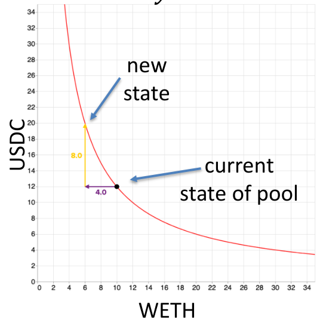
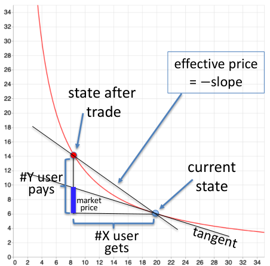

# Cryptocurrency Decentralized Exchange Report

## I. What is this?

Report of my attempt on creating a decentralized cryptocurrency exchange, based on Stanford University's CS251 proj4.

This project is worked on intermittently over the course of a month, starting from May 21st, 2024. It will cover how AMM work, the design, implementation, as well as limitations. Most importantly, it will be a refection of what I have learned, challenges I faced, and what I can do better in the future.

## II. The Decentralized Exchange

An **Exchange** facilitates the trading of one asset to another in order to mitigate risk, preserve value, achieve liquidity, without the need for commodity of equivalent value.

Traditionally, this is handled by a *centralized* entity, which acts as intermediary between buyers and sellers, and charges fees for the service. Such centralization, though might have been the historical way that we do things, comes with some issues, namely:

- **Trust and Censorship**: Acting as the governing entity, CEX can make unilateral decisions, seize funds, refuse to do business. Users have no means to ensure the CEX operates correctly or fairly. On the other hand, CEX uses trust and the vast resource at its disposal to maintain its user-base.
- **Transparency and Security**: Users rely on the CEX to facilitate transactions, limiting their autonomy and control as well as access to information. While convenient, this is also a single-point-of-failure, held at stake of the centralized governance.

A **Decentralized Exchange (DEX)**, enabled by blockchain technology, on the other hand, facilitates tradings directly between market participants, operating on the principles of *programmability*, *transparency*, *permissionless*, and *non-custodial* asset management.

## III. Automated Market Maker
**Automated Market Maker** (AMM), is a type of decentralized exchange that relies on algorithm to price assets and facilitate trades, living directly on the blockchain, it fully leverages all of web3's merits: an accessible, efficient and easy to bootstrap.

Main participants:
- Liquidity providers (LPs) deposit assets into an liquidity pool on-chain to earn interest based on their ownership proportion.
- Traders calls the AMM contract to swap assets, taking advantage of the volatility of one asset and the stability of another to make profit.

### 1. Exchange rate
The first think to consider when it comes to any Exchange is the exchange rate.
For a liquidity pool of 2 assets that has (`x` units of **X**) and (`y` units of **Y**), a reasonable goal would be to maintain the balance of these assets in value. Otherwise, it wouldn't be much of a decentralized exchange and more of a decentralized pot-luck.

Consider the following example:
- Alice wants to sell an amount of **X**, `dx` for some `dy` in return. The pool state is updated to maintain the price balance. For this trade, the **marginal price** is defined as `p = -dy/dx`, the exchange rate at the moment.
- This **marginal price** can be used to estimate the value of assets in the pool, X in terms of Y: `px = y`
- Plugging into definition for the following differential equation:

$$
-\frac{dy}{dx} = \frac{y}{x}
$$

- Solving the differential equation, we have an unique solution: $x \cdot y = k$ , for $k \in \mathbb{R}$

Indeed, by maintaining this constant product, the AMM can ensure that the price of the assets in the pool is balanced. This is known as the **Constant Product Market Maker**.

With the constant product market maker, the exchange rate is maintained. With $x \cdot y = k$, we use `k` to calculate the values going out of the pool for every assets traded into the pool. And update `k` when LPs deposit or withdraw. 

For an arbitrary trade of amount $\Delta x$:

$$
(x - \Delta x) (y + \Delta y) = k
$$

$$
\Delta y = \frac{y \cdot \Delta x}{x - \Delta x} \quad \text{(k is maintained)}
$$

### 2. Implications and Incentives

#### 2.1 LPs
In order to entice people to become **LPs**, a percentage of every trade is be taken out as reward, denoted as $\Phi \in [0, 1]$. For every trade where $\Delta y $ is paid, $\Phi \Delta y$ goes to the pool.

Liquidity providers activities must *not* change the `marginal price`, and so the ratio of assets going in or out must match that ratio in the pool, and will move constant `k` up or down accordingly.

$$
\text{Maintain } (x - \Delta x)(y + \Phi \Delta y) = k
$$

$$
\Delta y = \frac{1}{\Phi} \frac{y \Delta x}{x - \Delta x}
$$

The fee from each trade is distributed among LPs in proportion to their `share` of the pool - that is, the portion of the total values that their assets correspond to.

#### 2.2 Traders
While LPs see the pools as long term investments, traders are more interested in short term profit. AMM make *great* arbitrage opportunities, as the price is determined by the pool's state, and not by the market. By taking advantage of price differences between markets, traders can make a profit, at the LPs' loss.

Naturally, this moves the exchange rate of the liquidity pool towards the market price. This is known as "Automated price discovery".

But for traders, one more thing comes to mind, "Slippage"

### 3. Slippage

Slippage is a significant problem in decentralized exchanges (DEXs) that can occur due to the decentralized nature of these platforms. Slippage refers to the difference between the expected price of a trade and the actual executed price. The larger the trade, the worst  the price becomes.

 

Consider that $\Delta y = \frac{y \Delta x}{x - \Delta x}$, this means that the pool will never run out of liquidity, since as $\Delta x\$ approaches x, the price for it approaches $\infty$

## IV. Implementation
[implementation](./implementation.md) 
